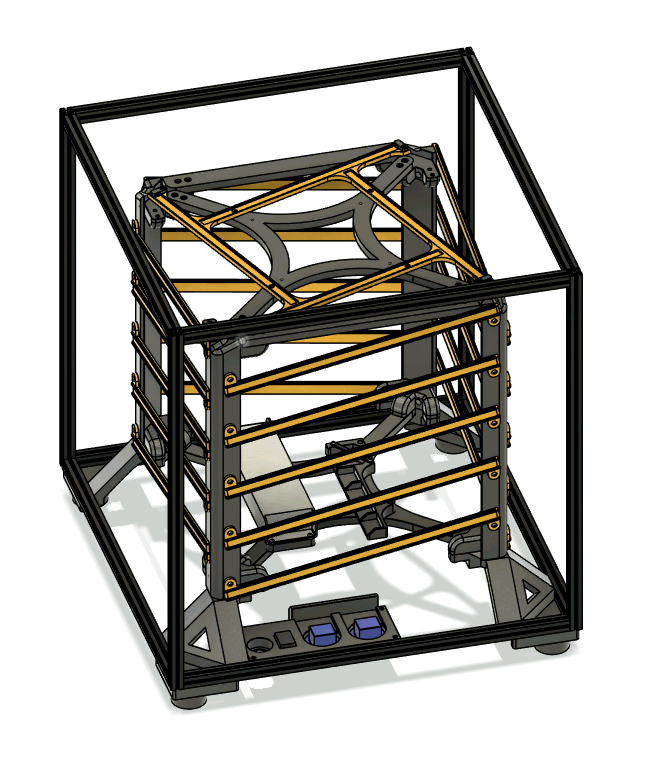
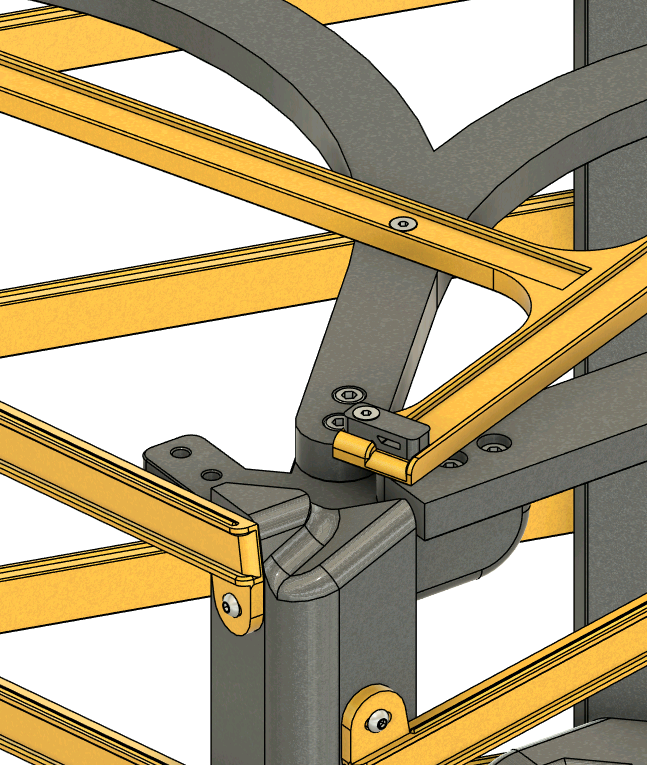
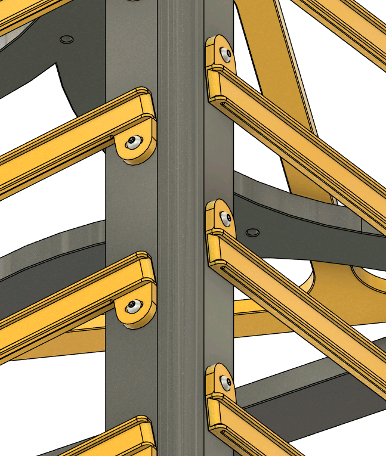
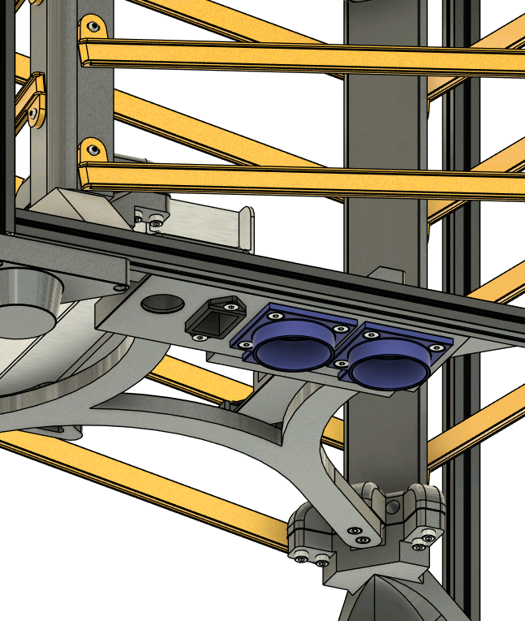

# Boron
Boron is a DYI light cube for branding purposes, inspired by Voron printer frame construction.

Boron (Box-Voron) is an open-source light cube that can be built for relatively cheap. The sides graphics are interchangeable and allow for quick reconfiguration by unscrewing the top of the frame. It allows us to display a large logo on a structure very similar to Voron printers.

The project is licensed under [GNU General Public License Version 3](https://www.gnu.org/licenses/gpl-3.0.en.html). This means, among others, that distributing either STL, printed parts or assemblies containing Boron, you must also make the modified CAD available to users. 

The design is built so that minimal electronics and soldering work is required. A 10-meter LED strip is cut into 4 equal sections and is wrapped around the cube's guide channels. Each strip's end arrives at the top of the cube, where it transitions to the top face. The electronics operate at 24V to allow the Shelly controller to switch more power for the same current.

|  |  |  |  | 
| -- | -- | -- | -- |

